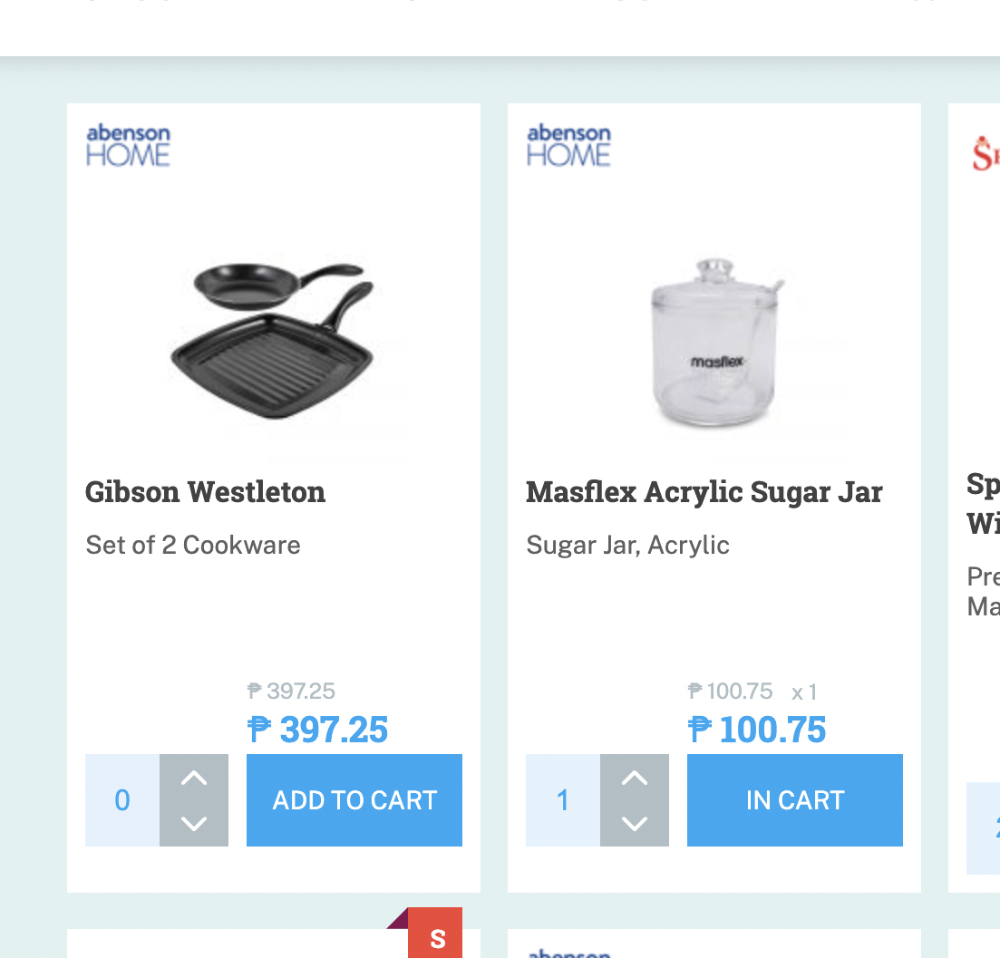
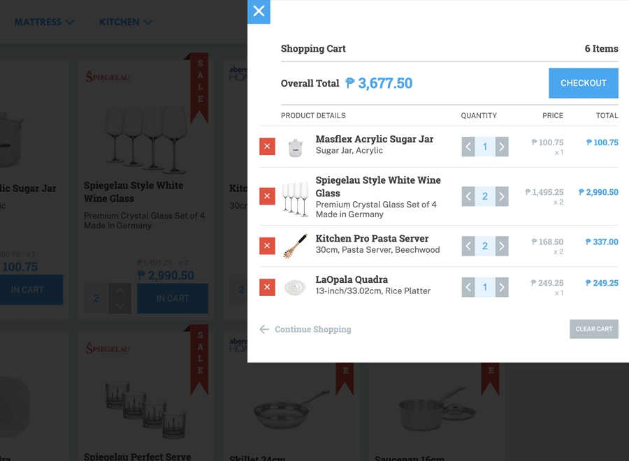

# Products To Cart

So far, this is the most enjoyable project that I did and finished this year. This was done from sketch, to design, then developed with HTML5, SASS, and Vanilla JavaScript. This is some sort of an E-commerce project but at the front-end only. When the page loads, products are loaded with prices, then a user can add products to the cart.

Usually, on an E-commerce website, when a user wants to add a product to cart or buy a product, the user will click that product then the user will be directed to a single product page, where the user can click 'ADD TO CART', specify the quanity of the product or read more details about the product like information, reviews and etc.

In this project, I kinda explore something different. At the front-end, where the products are displayed, the user can directly, put the quanity of the product, click the 
'ADD TO CART' button, or 'UPDATE CART' when a particular product is already added to the cart.

 

The UP ARROW and DOWN ARROW button will increase and decrease the quantity of the product. But, it'll not decrease if the user keeps pressing the decrease button while the quantity is 0. For this project, when the user clicks the UP ARROW button 1 time, the product is added to the cart with the quantity of 1, then the ADD TO CART button will change its text into IN CART, specifying that the product is added to the cart. Clicking the UP ARROW button again, when the product is already in the cart with the quantity of 1, the IN CART text will change to UPDATE CART, that means we can update the quantiy of that product in the cart.

The user can click the SHOPPING CART button to see the products that are added to the cart. The CHECKOUT button doesn't do anything by the way. At the ealy stages of coding, I was using 'data.json' for the product details and later on, I put them in [Contentful](https://www.contentful.com/). I learned to use it after watching the [John Smilga's](https://www.youtube.com/c/CodingAddict/featured) [E-Commerce JavaScript Tutorial - Shopping Cart from Scratch](https://www.youtube.com/watch?v=023Psne_-_4) tutorial on [Freecodecamp](https://www.youtube.com/c/Freecodecamp).

### Project Screenshot

 

Live Site URL: [Live Demo](https://kennyestrellaworks-products-to-cart.netlify.app/)

### Used technologies
   